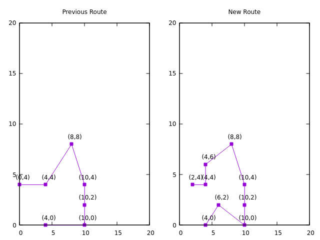

# Efficient Insertion Operator in Dynamic Ridesharing

## Table of Contents
- [Introduction](#introduction)
- [Problem Statement](#problem-statement)
- [Objectives](#objectives)
- [Data Structures Used](#data-structures-used)
- [Testing](#testing)
- [Conclusion](#conclusion)

## Introduction

This project is the implementation of effiecient insertion operator in dynamic ridesharing in C language.

## Problem Statement

The core operation in dynamic ridesharing is the **Insertion Operator**. Given a worker's current route and a newly arrived request, the insertion operator aims to insert the new request into the existing route in a way that optimizes certain criteria. The primary goal is to enhance efficiency and improve the overall user experience.

## Objectives

1. **Efficiency Improvement:** The project aims to reduce the time complexity of the insertion operator from O(n^3) to O(n^2) and ultimately to O(nlog(n)).
2. **Optimization from Requests' Perspective:** The insertion operator should minimize the maximum flow time, leading to better resource utilization and an improved user experience.

## Data Structures Used

The project employs the following data structures to achieve its objectives:

- **Segment Tree:** Utilized for efficient range queries and updates, particularly useful for optimizing insertion point searches.
- **Arrays & Dynamic Programming Table:** Used to store and manipulate information regarding routes and insertion points.
- **Linked Lists:** Employed for maintaining the sequence of origin-destination pairs within routes.

## Testing

*Used GNU Plot for plotting the coordinates of route.*

## Conclusion

The Efficient Insertion Operator in Dynamic Ridesharing project focuses on a critical aspect of real-time service optimization. By addressing the insertion problem efficiently and optimizing route adjustments, the project aims to enhance the efficiency, resource utilization, and user satisfaction in dynamic ridesharing scenarios.

*This is the implementation of the research paper: 
["An Efficient Insertion Operator in Dynamic Ridesharing Services” 		by “Yi Xu, Yongxin Tong, Yexuan Shi , Qian Tao, Ke Xu, and Wei Li”.
IEEE TRANSACTIONS ON KNOWLEDGE AND DATA ENGINEERING, VOL. 34, NO. 8, AUGUST 2022.](https://ieeexplore.ieee.org/document/8731569)*
